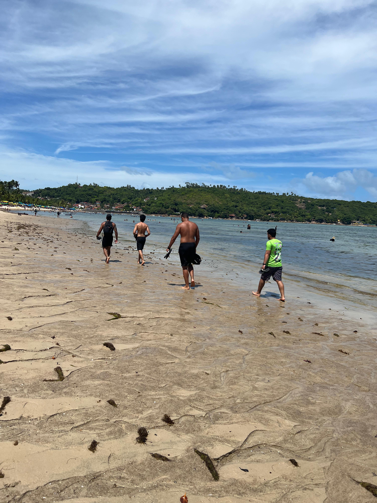
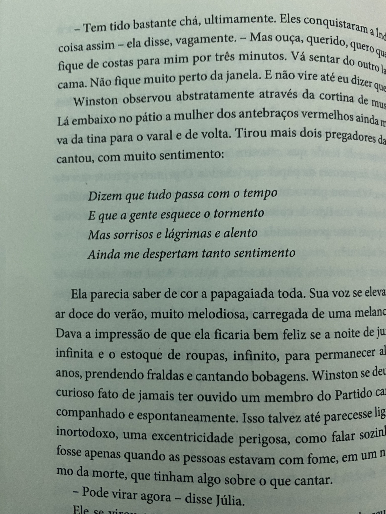
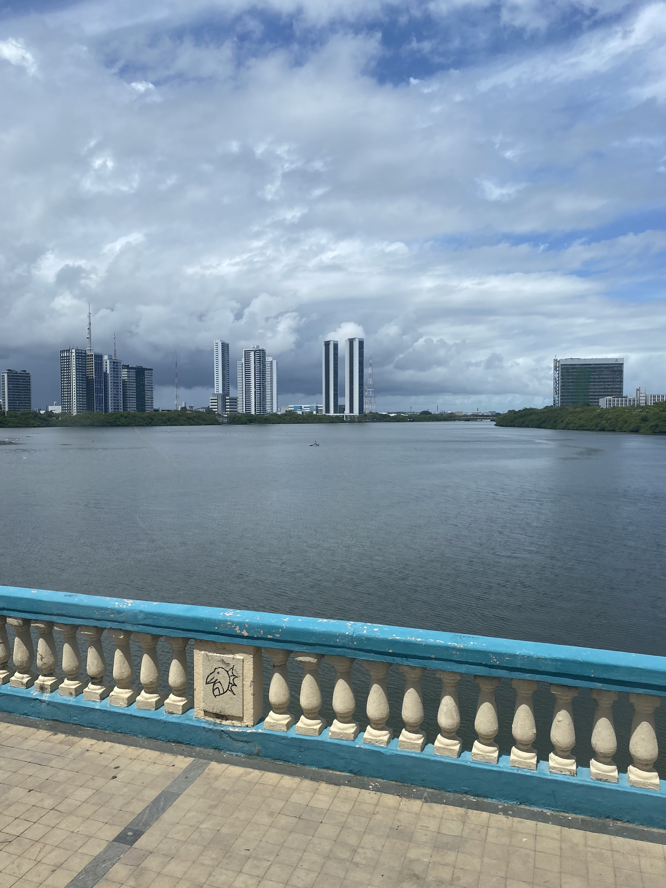
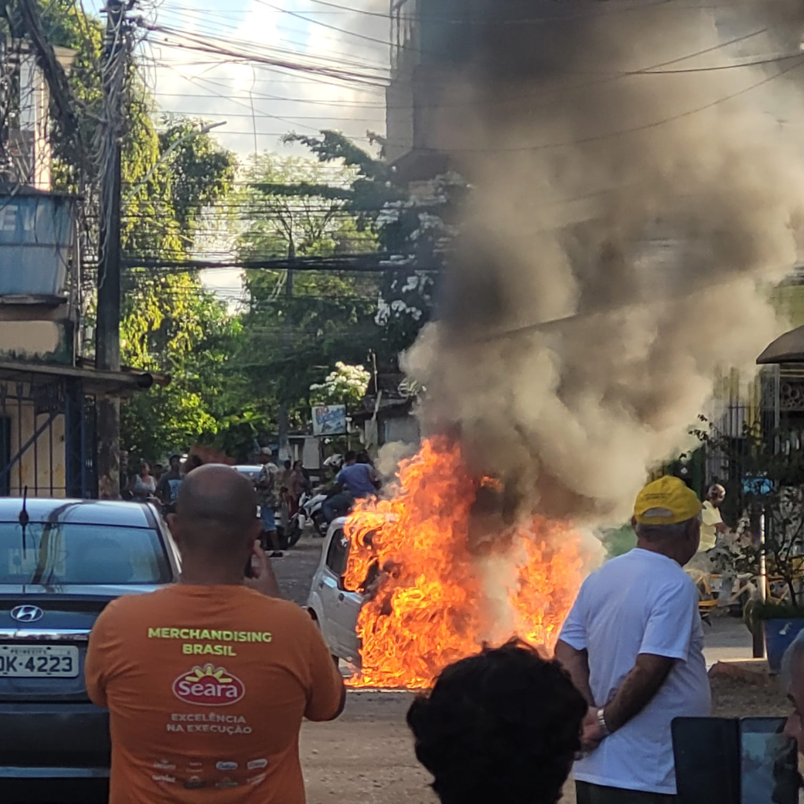
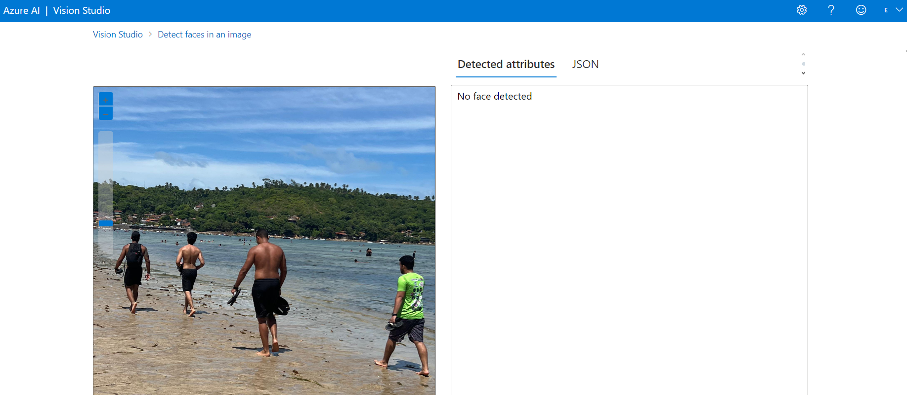
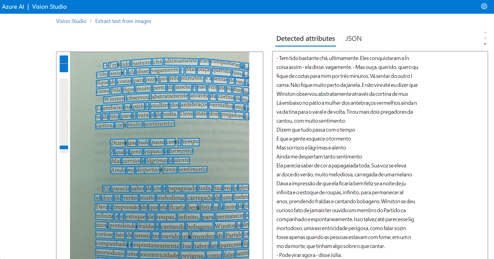
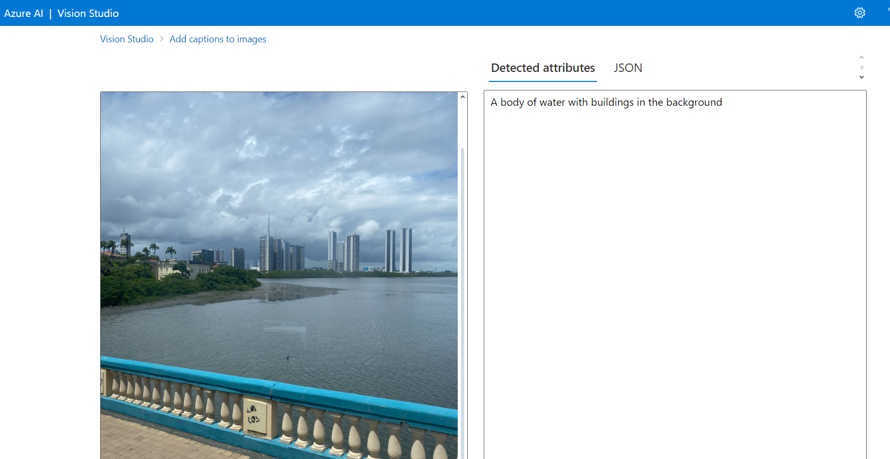
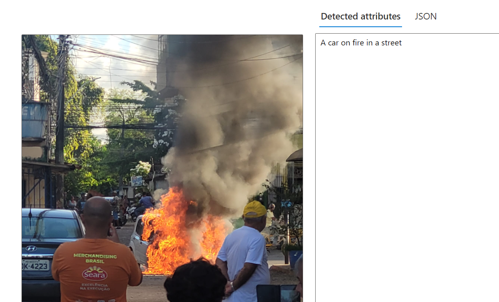

# Automated Machine Learning in Azure Machine Learning With Images

Este repositório foi criado para apresentar minha experiência com a ferramenta de Aprendizado de Máquina da Azure utilizando imagens para leitura da IA, a qual foi aprendida durante o bootcamp da DIO seguindo o(s) seguinte(s) [tutorial 1](https://microsoftlearning.github.io/mslearn-ai-fundamentals/Instructions/Labs/04-face.html), [tutorial 2](https://microsoftlearning.github.io/mslearn-ai-fundamentals/Instructions/Labs/05-ocr.html), [tutorial 3](https://microsoftlearning.github.io/mslearn-ai-fundamentals/Instructions/Labs/03-image-analysis.html) do site da Azure AI Vision Studio para empregar uma das ferramentas de Inteligência Artificial disponibilizadas pela Azure para leitura e descrição de fotos. Isso permite explorar diferentes algoritmos e parâmetros para treinar diversos modelos e identificar o mais adequado para os seus vídeos e imagens. O guia envolve a inclusão de imagens de sua galeria de fotos ou da internet, utilizando o próprio site.

## Insights

Tive muitos insights nesse móudulo mas com toda certeza um dos principais foram para utilizar em fazendas do agronegócio e também para segurança de lugares privados bem como estádios de futebol, onde um presidente ou alguém importante poderia ter livre acesso pelo local ou até mesmo alguém banido de não entrar de jeito nenhum.

## Fotos tiradas por mim

## Fotos tiradas por mim

## Fotos tiradas por mim

## Fotos tiradas por mim

## Resultados da IA

## Resultados da IA

## Resultados da IA

## Resultados da IA

## Requisitos

- Criar uma conta grátis no Microsoft Azure e seguir o passo a passo.
